# 42 SEO Skills — Skill Map

Hierarchische weergave van alle 58 skills: fase-toewijzing, onderlinge dependencies,
benodigde input formats, en welke agents ze gebruiken.

---

## Skill Hierarchy per Fase

```mermaid
graph TD
    classDef crawl fill:#1a1a2e,stroke:#e94560,color:#fff
    classDef discover fill:#1a1a2e,stroke:#0f3460,color:#fff
    classDef diagnose fill:#1a1a2e,stroke:#533483,color:#fff
    classDef strategize fill:#1a1a2e,stroke:#e94560,color:#fff
    classDef implement fill:#1a1a2e,stroke:#16213e,color:#fff
    classDef verify fill:#1a1a2e,stroke:#0f3460,color:#fff
    classDef monitor fill:#1a1a2e,stroke:#533483,color:#fff
    classDef orch fill:#e94560,stroke:#fff,color:#fff

    PROJ[42:seo-project<br/>Meta-orchestrator]:::orch
    AUDIT[42:audit<br/>Unified audit orchestrator]:::orch
    STAT[42:status<br/>Project dashboard]:::orch

    subgraph "Phase 0: CRAWL"
        SF[42:screaming-frog]:::crawl
    end

    subgraph "Phase 1: DISCOVER"
        KD[42:keyword-discovery]:::discover
        PAA[42:paa-scraper]:::discover
    end

    subgraph "Phase 2: DIAGNOSE"
        TECH[42:technical]:::diagnose
        CONT[42:content]:::diagnose
        SD[42:structured-data]:::diagnose
        BM[42:brand-mentions]:::diagnose
        BI[42:brand-intelligence]:::diagnose
        CANN[42:cannibalization]:::diagnose
        ECOM[42:ecom-taxonomy]:::diagnose
        ENT[42:entity-extractor]:::diagnose
        IL[42:internal-links]:::diagnose
        KM[42:keyword-mapper]:::diagnose
        LG[42:link-graph]:::diagnose
        ND[42:near-duplicates]:::diagnose
        PH[42:page-health]:::diagnose
        SG[42:seo-geo]:::diagnose
    end

    subgraph "Phase 3: STRATEGIZE"
        AV[42:ai-visibility]:::strategize
        AA[42:audience-angles]:::strategize
        GP[42:geo-proposal]:::strategize
        GS[42:geo-sales]:::strategize
        PS[42:programmatic-seo]:::strategize
        SP[42:seo-plan]:::strategize
        SC[42:serp-cluster]:::strategize
        TM[42:topical-map]:::strategize
    end

    subgraph "Phase 4: IMPLEMENT"
        BG[42:blog-geo]:::implement
        BS[42:blog-schema]:::implement
        CIT[42:citability]:::implement
        CP[42:competitor-pages]:::implement
        CR[42:content-repurposer]:::implement
        GO[42:genai-optimizer]:::implement
        HR[42:hreflang]:::implement
        LT[42:llmstxt]:::implement
        MO[42:meta-optimizer]:::implement
        PO[42:platform-optimizer]:::implement
        PT[42:product-titles]:::implement
        SAG[42:seo-agi]:::implement
        SIT[42:sitemap]:::implement
        SD2[42:structured-data --gen]:::implement
        TO[42:title-optimizer]:::implement
    end

    subgraph "Phase 5: VERIFY"
        BLG[42:blog]:::verify
        BSC[42:blog-seo-check]:::verify
        CR2[42:crawlers]:::verify
        GR[42:geo-report]:::verify
        IMG[42:images]:::verify
        MIG[42:migration]:::verify
        PA[42:page-analysis]:::verify
        PAS[42:passage-analyzer]:::verify
        QRG[42:qrg]:::verify
        RD[42:readability]:::verify
        STR[42:striking-distance]:::verify
        TECH2[42:technical --verify]:::verify
    end

    subgraph "Phase 6: MONITOR"
        CD[42:content-decay]:::monitor
        GC[42:geo-compare]:::monitor
        GPR[42:geo-prospect]:::monitor
        SEN[42:sentiment]:::monitor
        SOV[42:share-of-voice]:::monitor
    end

    %% Orchestrator flow
    PROJ --> SF
    PROJ --> AUDIT
    PROJ --> STAT
    AUDIT --> TECH
    AUDIT --> CONT
    AUDIT --> SD
    AUDIT --> BM
    AUDIT --> BI
    AUDIT --> CR2
    AUDIT --> PH

    %% Critical data dependencies
    SF -->|"embeddings CSV"| KM
    SF -->|"Internal:HTML CSV"| PH
    SF -->|"Inlinks:All CSV"| LG
    SF -->|"crawl CSV"| CANN
    SF -->|"crawl CSV"| ECOM
    SF -->|"crawl CSV"| ND
    SF -->|"text export"| RD
    SF -->|"Internal:HTML CSV"| STR
    SF -->|"Internal:HTML CSV"| MO

    %% Discover → Strategize flow
    KD -->|"keyword CSV"| TM
    KD -->|"keyword CSV"| SC
    KD -->|"keyword CSV"| AA

    %% Diagnose → Implement flow
    CONT -->|"content gaps"| GO
    TECH -->|"technical issues"| SIT
    SD -->|"schema gaps"| SD2

    %% Cross-phase dependencies
    GC -->|"2 audit reports"| GR
```



---

## Dependency Chains

Kritieke data-afhankelijkheden waarbij skill A output nodig heeft van skill B.

### Screaming Frog als Data Foundation

```
42:screaming-frog (Phase 0)
  │
  ├── embeddings CSV ──────→ 42:keyword-mapper (Phase 2)
  ├── Internal:HTML CSV ───→ 42:page-health (Phase 2)
  ├── Internal:HTML CSV ───→ 42:striking-distance (Phase 5)
  ├── Internal:HTML CSV ───→ 42:meta-optimizer (Phase 4)
  ├── Inlinks:All CSV ─────→ 42:link-graph (Phase 2)
  ├── crawl CSV ───────────→ 42:cannibalization (Phase 2)
  ├── crawl CSV ───────────→ 42:ecom-taxonomy (Phase 2)
  ├── crawl CSV/hashes ────→ 42:near-duplicates (Phase 2)
  ├── text export ─────────→ 42:readability (Phase 5)
  └── Internal:HTML CSV ───→ 42:migration (Phase 5)
```

### Keyword Discovery Chain

```
42:keyword-discovery (Phase 1)
  │
  ├── keyword CSV ─→ 42:topical-map (Phase 3)
  ├── keyword CSV ─→ 42:serp-cluster (Phase 3)
  └── keyword CSV ─→ 42:audience-angles (Phase 3)
```

### Audit → Report Chain

```
42:audit (Phase 2)
  │
  ├── SEO+GEO scores ─→ 42:geo-proposal (Phase 3)
  ├── SEO+GEO scores ─→ 42:seo-plan (Phase 3)
  └── audit report ────→ 42:geo-compare (Phase 6) ─→ 42:geo-report (Phase 5)
```

### Skills ZONDER Dependencies (standalone)

Deze skills werken volledig onafhankelijk — alleen een URL of tekst nodig:

| Skill | Minimale input |
|-------|---------------|
| 42:technical | URL |
| 42:content | URL |
| 42:structured-data | URL |
| 42:brand-mentions | domein naam |
| 42:entity-extractor | URL of tekst |
| 42:citability | URL of tekst |
| 42:genai-optimizer | URL of tekst |
| 42:blog-geo | URL of tekst |
| 42:blog-schema | URL of tekst |
| 42:blog-seo-check | URL of tekst |
| 42:crawlers | domein URL |
| 42:llmstxt | domein URL |
| 42:hreflang | domein URL of sitemap |
| 42:platform-optimizer | URL |
| 42:passage-analyzer | URL of tekst |
| 42:page-analysis | URL |
| 42:qrg | URL |
| 42:seo-agi | URL of keyword |
| 42:title-optimizer | URL of tekst |
| 42:competitor-pages | keyword of categorie |
| 42:content-repurposer | URL of tekst |
| 42:seo-plan | business type |
| 42:sentiment | zoekterm |
| 42:ai-visibility | GSC queries of domein |
| 42:blog | URL of tekst |
| 42:brand-intelligence | domein naam |
| 42:status | project map (STATE.md) |

---

## Input Formats per Skill

### CSV Input Skills

| Skill | CSV Type | Vereiste Kolommen | Bron |
|-------|----------|-------------------|------|
| **42:keyword-mapper** | SF Embeddings + GSC | URL, Embeddings vector + Query, Clicks, Impressions, Position | Screaming Frog + GSC export |
| **42:page-health** | SF Internal:HTML | Address, Status Code, Title, H1, Indexability, Word Count, Inlinks, Canonical | Screaming Frog export |
| **42:link-graph** | SF Inlinks:All | Source, Destination, Anchor, Type | Screaming Frog export |
| **42:cannibalization** | SF crawl of keywords | Address + keyword data, of keyword lijst | Screaming Frog of handmatig |
| **42:ecom-taxonomy** | SF crawl + categories | Address, Content Type, Category path | Screaming Frog export |
| **42:near-duplicates** | SF crawl | Address, Hash, Near Duplicate Address | Screaming Frog export |
| **42:striking-distance** | GSC Performance + SF | Query, Page, Clicks, Impressions, Position + Address, Title, H1 | GSC export + Screaming Frog |
| **42:content-decay** | GSC Performance (Date) | Date, Page, Clicks, Impressions | GSC export (Date + Page dimensies) |
| **42:meta-optimizer** | URL lijst | Address (of URL kolom) | SF export, handmatig CSV, of URL lijst |
| **42:product-titles** | Product data | MPN/SKU, Current Title, Brand, Category | PIM/ecommerce export |
| **42:serp-cluster** | Keywords | Keyword (of Keyword + Volume) | Handmatig of 42:keyword-discovery |
| **42:topical-map** | Keywords | Keyword, Volume (optioneel), Intent (optioneel) | Handmatig of 42:keyword-discovery |
| **42:readability** | SF text export of URLs | Address, Body Text (of alleen URLs) | Screaming Frog of handmatig |
| **42:keyword-discovery** | Seed keywords | Keyword (1 kolom) | Handmatig CSV of TXT |

### URL Input Skills

| Skill | Input | Extra Parameters |
|-------|-------|-----------------|
| **42:screaming-frog** | `https://example.com` | `crawl`, `export --bulk`, `analyze`, `compare` |
| **42:technical** | `https://example.com` | `--seo`, `--geo`, of default (beide) |
| **42:content** | `https://example.com` | `--seo`, `--geo`, of default (beide) |
| **42:structured-data** | `https://example.com` | `--seo`, `--geo`, `--blog` |
| **42:brand-mentions** | `example.com` | geen |
| **42:crawlers** | `example.com` | geen |
| **42:llmstxt** | `example.com` | Mode 1: analyze, Mode 2: generate |
| **42:hreflang** | `example.com` of sitemap URL | output: HTML, HTTP header, of sitemap |
| **42:platform-optimizer** | `https://example.com/page` | 5 platforms: AIO, ChatGPT, Perplexity, Gemini, Copilot |
| **42:images** | `https://example.com` | of SF crawl CSV |
| **42:sitemap** | `example.com` | of CSV met pagina data |
| **42:page-analysis** | `https://example.com/page` | optioneel: GSC data, SF crawl |
| **42:qrg** | `https://example.com/page` | optioneel: DataForSEO credentials |
| **42:migration** | old URL + new URL | 3 modes: redirect, content change, Wayback |

### Text/Content Input Skills

| Skill | Accepteert | Voorbeeld |
|-------|-----------|-----------|
| **42:citability** | URL, filepath, of platte tekst | `https://...` of `/path/to/article.md` |
| **42:genai-optimizer** | URL, filepath, of platte tekst | Herschrijft voor AI extractability |
| **42:passage-analyzer** | URL, filepath, of platte tekst | 6-dimensie passage scoring |
| **42:entity-extractor** | URL, filepath, of platte tekst | NER + entity relaties |
| **42:title-optimizer** | URL, filepath, of platte tekst | 3-ronde iteratieve optimalisatie |
| **42:content-repurposer** | URL, filepath, of platte tekst | 10 platform formats |
| **42:blog-geo** | URL of markdown tekst | 15-punt GEO scoring |
| **42:blog-schema** | URL of markdown tekst | JSON-LD @graph generatie |
| **42:blog-seo-check** | URL of markdown tekst | 11-punt pass/fail checklist |
| **42:audience-angles** | URL, filepath, of platte tekst | 50 content angles |
| **42:seo-agi** | URL of keyword | GEO-optimized pagina schrijven |
| **42:blog** | URL of markdown tekst | Unified blog audit: SEO + GEO + schema |

### Samengestelde Input Skills

| Skill | Primaire Input | Secundaire Input | Bron |
|-------|---------------|-----------------|------|
| **42:geo-compare** | Audit rapport A (baseline) | Audit rapport B (current) | 2x 42:audit output |
| **42:geo-report** | Meerdere audit outputs | platform-optimizer, structured-data, technical, content, llmstxt, brand-mentions | Diverse 42:* skills |
| **42:geo-proposal** | Domein URL | GEO audit data | 42:audit (GEO mode) |
| **42:share-of-voice** | Target keywords + domein | Competitor domeinen (optioneel) | Handmatig of 42:keyword-discovery |
| **42:internal-links** | Competitor URLs | Client URLs | Handmatig |
| **42:keyword-mapper** | SF embeddings CSV | GSC queries CSV | 42:screaming-frog + GSC |
| **42:geo-sales** | Prospect domein | GEO audit data + pricing tier | 42:audit (GEO mode) |

---

## API Dependencies per Skill

| API | Skills die het gebruiken | Tier |
|-----|------------------------|------|
| **DataForSEO** | keyword-discovery, paa-scraper, serp-cluster, cannibalization, seo-agi, qrg, share-of-voice, product-titles, striking-distance | Tier 2+ |
| **Google Gemini** | keyword-mapper, passage-analyzer, meta-optimizer, entity-extractor, topical-map, content-repurposer, near-duplicates | Tier 2+ |
| **GSC (Service Account)** | striking-distance, content-decay, keyword-mapper (optioneel) | Tier 3 |
| **Screaming Frog CLI** | screaming-frog, keyword-mapper, page-health, link-graph, cannibalization, ecom-taxonomy, near-duplicates, readability, meta-optimizer | Tier 3 |
| **Geen API nodig** | Alle overige skills incl. blog, brand-intelligence, geo-sales, status (werken via URL fetch + WebSearch) | Tier 1 |

---

## Agent Types per Skill

| Allowed Tools | Skills |
|--------------|--------|
| **Bash, Read, Write, Grep, Glob** | screaming-frog, keyword-discovery, paa-scraper, serp-cluster, keyword-mapper, link-graph, near-duplicates, page-health, readability, striking-distance, share-of-voice, content-decay |
| **Read, Write, Bash, WebFetch** | technical, seo-agi, seo-geo, platform-optimizer, hreflang, passage-analyzer |
| **Read, Write, WebFetch** | content, citability, blog-geo, blog-schema, blog-seo-check, crawlers, llmstxt, genai-optimizer, entity-extractor, brand-mentions |
| **Read, Write, Bash, Grep, Glob** | meta-optimizer, product-titles, cannibalization, ecom-taxonomy, internal-links, title-optimizer, topical-map |
| **Read, Write, Edit, Bash, Glob, Grep** | geo-report, geo-compare, geo-prospect |
| **11 parallel subagents** | audit (orchestrator — delegeert naar specialist skills) |
| **Read, Write, Edit, Bash, Glob, Grep, WebFetch** | seo-project (meta-orchestrator) |

---

## Quick Reference: Fase → Skills → Input

```
Orchestrators
  ├─ seo-project ← project map (meta-orchestrator)
  ├─ audit ← URL (unified audit orchestrator)
  └─ status ← project map (dashboard)

Phase 0: CRAWL
  └─ screaming-frog ← URL

Phase 1: DISCOVER
  ├─ keyword-discovery ← seed keywords (string/CSV/TXT)
  └─ paa-scraper ← keyword (string)

Phase 2: DIAGNOSE
  ├─ audit ← URL (orchestreert onderstaande)
  ├─ technical ← URL
  ├─ content ← URL
  ├─ structured-data ← URL
  ├─ brand-mentions ← domein
  ├─ brand-intelligence ← domein
  ├─ seo-geo ← URL
  ├─ cannibalization ← SF CSV of keywords
  ├─ ecom-taxonomy ← SF CSV
  ├─ entity-extractor ← URL/tekst
  ├─ internal-links ← competitor URLs
  ├─ keyword-mapper ← SF embeddings CSV + GSC CSV
  ├─ link-graph ← SF Inlinks CSV
  ├─ near-duplicates ← SF CSV of URL
  └─ page-health ← SF Internal CSV

Phase 3: STRATEGIZE
  ├─ ai-visibility ← GSC queries
  ├─ audience-angles ← URL/tekst
  ├─ geo-proposal ← audit data
  ├─ geo-sales ← prospect domein + audit data
  ├─ programmatic-seo ← CSV/URL
  ├─ seo-plan ← business type
  ├─ serp-cluster ← keyword CSV
  └─ topical-map ← keyword CSV

Phase 4: IMPLEMENT
  ├─ blog-geo ← URL/tekst
  ├─ blog-schema ← URL/tekst
  ├─ citability ← URL/tekst
  ├─ competitor-pages ← keyword
  ├─ content-repurposer ← URL/tekst
  ├─ genai-optimizer ← URL/tekst
  ├─ hreflang ← domein/sitemap
  ├─ llmstxt ← domein
  ├─ meta-optimizer ← URL CSV
  ├─ platform-optimizer ← URL
  ├─ product-titles ← product CSV (MPN)
  ├─ seo-agi ← URL/keyword
  ├─ sitemap ← domein/CSV
  ├─ structured-data ← URL
  └─ title-optimizer ← URL/tekst

Phase 5: VERIFY
  ├─ blog ← URL/tekst (unified: --seo, --geo, --schema, --all)
  ├─ blog-seo-check ← URL/tekst
  ├─ crawlers ← domein
  ├─ geo-report ← meerdere audit outputs
  ├─ images ← URL of SF CSV
  ├─ migration ← old URL + new URL
  ├─ page-analysis ← URL
  ├─ passage-analyzer ← URL/tekst
  ├─ qrg ← URL
  ├─ readability ← URL of SF CSV
  ├─ striking-distance ← GSC CSV + SF CSV
  └─ technical ← URL (re-audit)

Phase 6: MONITOR
  ├─ content-decay ← GSC CSV (Date+Page)
  ├─ geo-compare ← 2 audit rapporten
  ├─ geo-prospect ← domein/prospect
  ├─ sentiment ← zoekterm
  └─ share-of-voice ← keywords + domein
```
